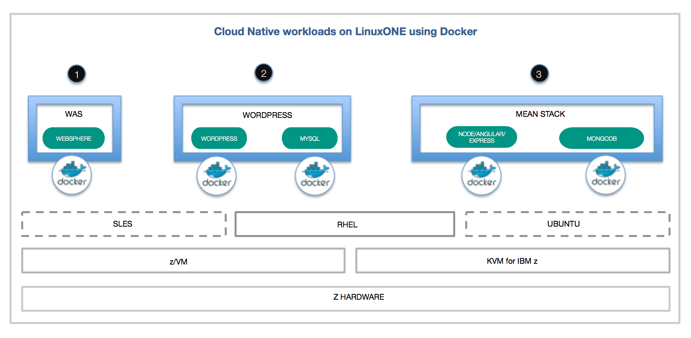

# Build and run open source cloud native workloads on LinuxONE using Docker

Open source software has expanded from a low-cost alternative to a platform for enterprise databases, clouds and next-generation apps. These workloads need higher levels of scalability, security and availability from the underlying hardware infrastructure.

LinuxONE was built for open source so you can harness the agility of the open revolution on the industry’s most secure, scalable and high-performing Linux server. In this journey we will show how to run open source Cloud-Native workloads on LinuxONE using Docker. We will show how existing LinuxONE docker images from docker hub can be used as is for deploying open source workloads. 

If the desired images don't exist, we also show how you can create your own dokcer images for the workload. The z architecture has a different instruction set from the typical machines used in distributed environments. If the Dockerfile has build steps that build native code, the right platform of the compile flags must be used to make it work on LinuxONE, in addition to accounting for specific packages which can be used with LinuxONE. The second part of this Journey goes into those details.


 
## Scenarios

1. [Scenario One: Use Docker images from Docker hub to run your workloads on LinuxONE](#scenario-one-use-docker-images-from-docker-hub-to-run-your-workloads-on-linuxone)     
    1.1 [WebSphere Liberty](#1-install-and-run-websphere-liberty)     
    1.2 [WordPress](#2-install-and-run-wordpress)          
2. [Scenario Two: Create your own Docker images for LinuxONE](#scenario-two-create-your-own-docker-images-for-linuxone)     
    2.1 [GitLab](#1-install-and-run-gitlab)

## Included Components

- [LinuxONE](https://www.ibm.com/linuxone/open-source)
- [Docker](https://www.docker.com)
- [WordPress](https://wordpress.org/about/)
- [GitLab](https://about.gitlab.com/)
- [WebSphere Liberty](https://hub.docker.com/r/s390x/websphere-liberty/)

## Prerequisites

Register at [LinuxONE Community Cloud](https://developer.ibm.com/linuxone/) for a trial account. We will be using a Ret Hat base image for this journey, so be sure to chose the 'Request your trial' button on the left side of this page.

## Scenario One: Use Docker images from Docker hub to run your workloads on LinuxONE

[Docker Hub](https://hub.docker.com) makes it rather simple to get started with containers, as there are quite a few images ready to for your to use.  You can browse the list of images that are compatible with LinuxONE by doing a search on the ['s390x'](https://hub.docker.com/search/?isAutomated=0&isOfficial=0&page=1&pullCount=0&q=s390x&starCount=0) tag.

These instructions assume a base RHEL 7.2 image.

We need to be running as root:
```shell
$ sudo su -
```

### Install docker
First, we will need to download the correct Docker package archive from [this page](https://www.ibm.com/developerworks/linux/linux390/docker.html).  For version 1.11.2 on RHEL 7.2:
```shell
# wget ftp://ftp.unicamp.br/pub/linuxpatch/s390x/redhat/rhel7.2/docker-1.11.2-rhel7.2-20160623.tar.gz
```

Then, unpack the archive and copy the docker binarys:
```shell
# tar -xzvf docker-1.11.2-rhel7.2-20160623.tar.gz
# cp docker-1.11.2-rhel7.2-20160623/docker* /usr/local/bin/
```

And then start the docker daemon:
```shell
# docker daemon -g /local/docker/lib &
```
You should see something similar to this:
```shell
[root@devjourney07 ~]# docker daemon -g /local/docker/lib &
[1] 2332
[root@devjourney07 ~]# INFO[0000] New containerd process, pid: 2338

WARN[0000] containerd: low RLIMIT_NOFILE changing to max  current=1024 max=4096
WARN[0001] devmapper: Usage of loopback devices is strongly discouraged for production use. Please use `--storage-opt dm.thinpooldev` or use `man docker` to refer to dm.thinpooldev section.
INFO[0001] devmapper: Creating filesystem xfs on device docker-94:2-263097-base
INFO[0001] devmapper: Successfully created filesystem xfs on device docker-94:2-263097-base
INFO[0001] Graph migration to content-addressability took 0.00 seconds
INFO[0001] Firewalld running: false
INFO[0001] Default bridge (docker0) is assigned with an IP address 172.17.0.0/16. Daemon option --bip can be used to set a preferred IP address
INFO[0001] Loading containers: start.

INFO[0001] Loading containers: done.
INFO[0001] Daemon has completed initialization
INFO[0001] Docker daemon                                 commit=b9f10c9-unsupported graphdriver=devicemapper version=1.11.2
INFO[0001] API listen on /var/run/docker.sock
```

### Install docker-compose

Install dependencies

```shell
# yum install -y python-setuptools
```

Install pip with easy_install

```shell
# easy_install pip
```

Upgrade backports.ssl_match_hostname

```shell
# pip install backports.ssl_match_hostname --upgrade
```

Finally, install docker-compose itself
```shell
# pip install docker-compose
```
### 1. Install and run WebSphere Liberty

In this step, we will once again be using existing images from Docker Hub - this time to set up a WebSphere Application Server.  We will be implementing it for Java EE 7 Full Platform compliance.

#### 1. Docker Run

Now run the container (note: we will need to be logged in as root)

```shell
# docker run -d -p 80:9080 -p 443:9443 s390x/websphere-liberty:webProfile7
```

#### 2. Browse

Once the server is started, you can browse to
`http://[LinuxOne Host IP]`.


### 2. Install and run WordPress

Let's start off with everyone's favorite demo: an installation of WordPress. These instructions assume a base RHEL 7.2 image. Please follow the instructions [here](https://github.com/IBM/Scalable-WordPress-deployment-on-Kubernetes/blob/master/docs/deploy-with-docker-on-linuxone.md#steps) to Install and run WordPress on LinuxOne

## Scenario Two: Create your own Docker images for LinuxONE

In our previous scenario, we used a couple of container images that had already been created and were waiting for our use in the Docker Hub Community.  But what if you are looking to run a workload that is not currently available there?  In this scenario, we will walk through the steps to create your own Docker images.

### 1. Install and run GitLab

GitLab is famous for its Git-based and code-tracking tool. GitLab represents a typical multi-tier app and each component will have their own container(s). The microservice containers will be for the web tier, the state/job database with Redis and PostgreSQL as the database.

By using different GitLab components (NGINX, Ruby on Rails, Redis, PostgreSQL, and more), you can deploy it to LinuxONE. Please follow the instructions [here](https://github.com/IBM/Kubernetes-container-service-GitLab-sample/blob/master/docs/deploy-with-docker-on-linuxone.md
) to get it up and running

